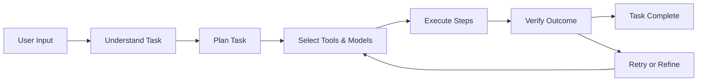

# Nexus AI — Executive Summary

> Status record and Agent Task v1 design summary for the Nexus AI Android project.

## 1. Current Repository & CI Status

- **Latest commit on `main`:** `bc5bfb8678b0e5e601768bdedf3705cdf5ff460c` (September 2026).
- **Latest Android CI:** Run **#79**, for the above commit, passed successfully.
- **Latest CI artifact:** `app-debug.apk`, approximately **10.3 MB**.
- **Current Gradle app version:** `versionCode = 1`, `versionName = "1.0"`.
- **GitHub Release:** `v0.8.1` exists and includes an `app-debug.apk` asset.
- **Important versioning note:** the current Gradle `versionName` is `1.0`, while the public release tag is `v0.8.1`. Future releases should align the Gradle version with the release tag.

## 2. Codebase — Key Modules

| Module / Component | Responsibility |
|---|---|
| `NexusAgent` | Orchestrates the agent loop and execution flow. |
| `AgentPlanner` | Breaks a user task into planned steps. |
| `ModelRouter` | Selects an appropriate model/route for a task step. |
| `ToolRegistry` | Registers and exposes tools/actions available to the agent. |
| Chat UI | Displays the conversation experience. |
| Task UI | Planned UI for task entry, timeline, step status, and final results. |

### Recent Compose Fix

A build error reported an unresolved `weight` reference in `ChatScreen.kt`. The root cause was calling `Modifier.weight(1f)` outside a `ColumnScope`. The fix moved the `weight(1f)` modifier to the parent `Column` call site where the modifier is valid.

Commit: `bc5bfb8678b0e5e601768bdedf3705cdf5ff460c`

## 3. Agent Task v1 — Product Direction

Nexus should evolve beyond a pure chat interface into a visible, structured agent experience.

The proposed lifecycle is:



### Main UI Flow

1. **New Task screen**
   - Task input field: “What should Nexus do?”
   - Start Task button.

2. **Task Timeline / Dashboard**
   - Vertical timeline or list of step cards.
   - Examples: `Understanding…`, `Planning…`, `Calling Web Search…`, `Analyzing…`, `Verifying…`.
   - Status indicators for pending, running, success, failure, and retry.

3. **Step Detail Card**
   - Tool/model used.
   - Relevant input and output.
   - Current progress.
   - Retry or stop controls when appropriate.

4. **Final Result Card**
   - Final answer/result.
   - Clear completion state.
   - Option to start another task.

### Suggested Task State Machine

```text
CREATED
  ↓
UNDERSTANDING
  ↓
PLANNING
  ↓
EXECUTING
  ↓
VERIFYING
  ├──→ COMPLETED
  └──→ RETRYING → EXECUTING

Possible waiting states:
WAITING_FOR_USER
WAITING_FOR_PERMISSION
WAITING_FOR_TOOL

Terminal failure:
FAILED
```

## 4. Agent Integration

The first implementation should connect the frontend to the existing local Agent Core instead of introducing a backend dependency immediately.

Target components:

```text
Task UI
  ↓
AgentTask
  ↓
NexusAgent
  ├── AgentPlanner
  ├── ModelRouter
  ├── ToolRegistry
  └── AgentVerifier
  ↓
AgentExecution / AgentResult
  ↓
Task UI state
```

The frontend should expose the agent's operational state without exposing private chain-of-thought. The UI can show safe, user-facing events such as:

- Understanding task
- Planning
- Selecting a tool
- Executing a tool
- Verifying result
- Retrying
- Completed
- Failed

## 5. Tool & Model Strategy

Tools should have clear definitions and can be conceptually grouped as:

- **Data tools:** retrieve information or context.
- **Action tools:** perform an external action.
- **Orchestration tools:** coordinate other agents or agent components.

`ToolRegistry` remains the central registration point.

`ModelRouter` should support dynamic routing so that simpler steps can use a faster/smaller model while complex tasks can use a stronger model.

## 6. Skills & GitHub Skill Learning

Nexus is building a legal and safety-conscious GitHub Skill learning pipeline:

```text
GitHub Search
    ↓
SKILL.md
    ↓
Source / Commit / License
    ↓
License Gate
    ↓
Security Review
    ↓
Concept Extraction
    ↓
Nexus-native Skill Synthesis
    ↓
Human Approval
    ↓
Skill Registry
```

The project should learn **concepts and operational patterns**, not indiscriminately copy third-party Skill files.

### Skill Status Principles

- `LEARN` — study ideas only.
- `REFERENCE` — useful reference with provenance retained.
- `ADOPT` — suitable for Nexus after license/security review and Nexus-native adaptation.
- `REJECT` — unsuitable, unclear, unsafe, or not reasonably usable.

Public visibility of a repository does not by itself grant permission to copy its contents. Provenance should record repository, path, commit/version, author, license, import date, modification status, and removal status when practical.

## 7. Android CI / CI-CD Skill

Nexus now has a native `android-ci-agent` Skill based on researched Android CI/CD practices.

Core operational loop:

```text
Run
 → Job
 → Step
 → Log
 → Classify failure
 → Make minimal confirmed fix
 → Commit
 → Re-run
 → Verify
 → Inspect artifact
```

Useful GitHub Actions operations include checking workflow runs, inspecting jobs/steps/logs, retrying failed jobs, and retrieving build artifacts.

## 8. Frontend-First Roadmap

The current priority is the Android frontend. The Python/server backend remains postponed and should not become a core dependency of the Android app at this stage.

### Milestones

1. **Agent Task UI v1**
   - Task entry.
   - Timeline.
   - Step cards.
   - Status indicators.
   - Result card.

2. **Connect Task UI to Agent Core**
   - Submit `AgentTask`.
   - Run `NexusAgent` asynchronously.
   - Map execution events to UI state.

3. **Real Tool Integration**
   - Start with safe, well-defined tools.
   - Verify tool results.
   - Add retry/error handling.

4. **Skills + Memory integration**
   - Skill Registry.
   - GitHub Skill Crawler.
   - Security/provenance review.
   - Long-term vs short-lived memory handling.

5. **Backend later**
   - Consider REST/SSE/WebSocket APIs only when a server is actually needed.
   - Backend must remain optional rather than a prerequisite for the core Android experience.

6. **CI/CD improvements**
   - Align `versionName` / `versionCode` with release tags.
   - Add tag-triggered release automation.
   - Build and attach release APK/AAB assets.

7. **Testing & QA**
   - Agent Core unit tests.
   - Task UI tests.
   - Integration tests for tool execution.
   - Manual end-to-end task flow verification.

## 9. Product UI Principle

Nexus can learn from the **agent-product experience** of existing AI agent apps, including the idea of making planning, tool use, verification, and completion visible.

However, Nexus should maintain its own:

- UI layout
- visual language
- components
- typography
- colors
- icons/assets
- interaction patterns

Do not copy proprietary UI, logos, assets, source code, or unpublished material.

## 10. Long-Term vs Short-Lived Memory

Nexus Memory should distinguish durable project knowledge from temporary runtime state.

### Long-term memory

- User preferences.
- Project architecture.
- Product decisions.
- Important technical decisions.
- Project rules and policies.

### Short-lived / expiring state

- CI run status.
- Current build state.
- Temporary bugs.
- Current task.
- Latest commit.

Current CI and build status should always be checked live when accuracy matters instead of relying on old chat memory.

## 11. Risks & Mitigations

- **UI freezes:** run agent work asynchronously with proper Kotlin coroutines.
- **Tool/network failures:** expose clear failure states and bounded retries.
- **Skill supply-chain risk:** perform license and security review before adoption.
- **Version confusion:** keep Gradle version and GitHub release tag aligned.
- **Scope creep:** keep backend postponed while frontend and Agent Core integration are developed.
- **Historical feature loss:** preserve and track useful existing functionality during refactors instead of deleting it unintentionally.

## 12. Immediate Next Step

### Build Agent Task v1 on Android

The next implementation target is:

```text
Home
  ↓
Start a task
  ↓
Task screen
  ↓
Understanding
  ↓
Planning
  ↓
Tool execution
  ↓
Verification
  ↓
Retry if needed
  ↓
Completed
```

The first version should use the existing `NexusAgent`, `AgentPlanner`, `ModelRouter`, `ToolRegistry`, and verifier infrastructure, with a clean Compose UI that makes the agent workflow visible and controllable.

---

## Related Nexus Documentation

- `docs/FRONTEND_BACKEND_ROADMAP.md`
- `docs/PROJECT_STATUS_33_RECORDS.md`
- `docs/GITHUB_SKILL_CRAWLER.md`
- `docs/SKILLS_POLICY.md`
- `docs/SKILLS_SOURCES.md`
- `skills/android-ci-agent/SKILL.md`
- `skills/github-skill-crawler/SKILL.md`
